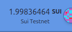

# Balance

Displays the balance of a given address in the native token (Sui).

## Screenshot


## Usage

```tsx
import { Balance } from "~~/components/scaffold-sui";
import { useCurrentAccount } from "@sui/dapp-kit";

const account = useCurrentAccount();
<Balance address={account?.address as string} />
```

## Parameter
| Parameter                | Type     | Default Value | Description                                                                                                               |
| ------------------------ | -------- | ------------- | ------------------------------------------------------------------------------------------------------------------------- |
| **address**              | `string` | `undefined`   | Address in `0x___` format. |
| **decimals**             | `number` | `10`          | Number of decimals for the Coin |
| **coinType**             | `string` | `0x2::sui::Sui` | Cointype representing the coin |
| **className** (optional) | `string` | `""`          | Prop to pass additional CSS styling to the component, where you can use Tailwind / daisyUI classes for styling. |
