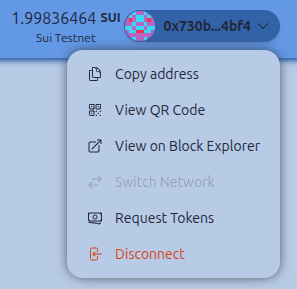

# CustomConnectButton

Scaffold Sui includes a custom Wallet Connect button with the following features:

- **Balance Display**: Shows native token balance of connected address.
- **Network Name**: Displays connected network name.
- **Faucet Integration**: On testnets, access the faucet directly from this Wallet Connect button.
- **Custom Modal**: Offers address copying, QR code view, block explorer link, network switching, and disconnect option.

## Screenshot


## Usage
```tsx
import { CustomConnectButton } from "~~/components/scaffold-sui";
<CustomConnectButton />
```
